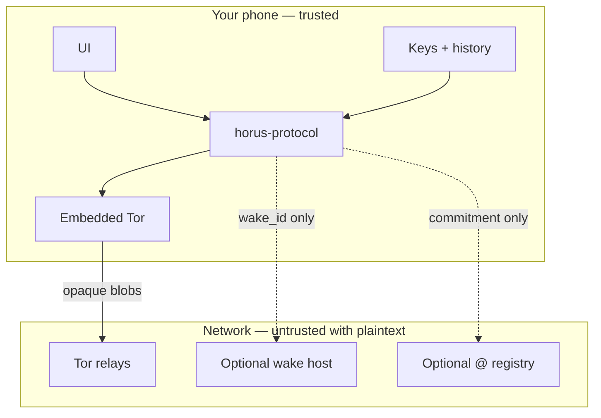
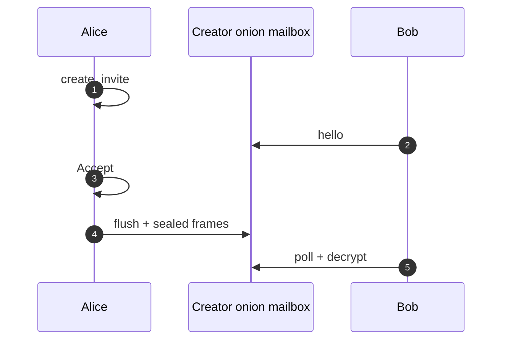
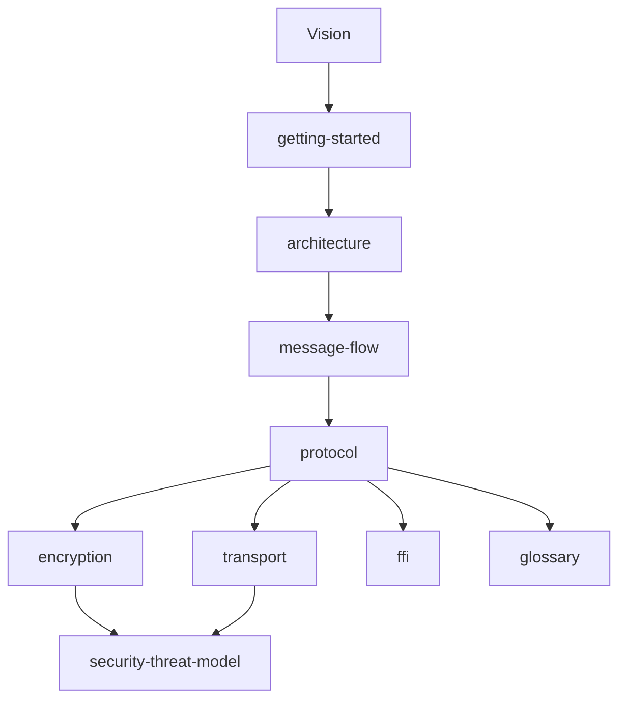

# Horus — documentation hub

**A private line.** No phone number. No cloud account. No feed.

This repository is the **technical front door** for the open Horus stack: how the protocol works, what is trusted, what is deliberately *not* claimed, and how to build or review against it.

For the product narrative (what it feels like to use), start at **[horus.a10x.eu](https://horus.a10x.eu)**.  
For the organization overview on GitHub, see **[github.com/horus-chat](https://github.com/horus-chat)**.

Official iOS / Android **UI is closed**. Crypto, invites, Tor mailboxes, relays, and `@` registry code are **open** under this org.

---

## Put it in perspective

| Family of apps | Typical bargain | Horus |
|----------------|-----------------|-------|
| WhatsApp / iMessage / Telegram | Easy graph (phone, cloud backup, rich push) | Refuses that graph |
| Signal | Strong E2EE; still phone-number identity | No phone identity |
| Session / SimpleX-style | Strong anonymity goals; UX often harder | Same direction: local keys, onion path, burnable invites — native UX |

Horus is not “Telegram but secret.” It is a **sealed session** between installs you invite. There is no Horus chat cloud. There is no recovery desk. That is the product.

---

## What ships open vs closed

| Open ([horus-chat](https://github.com/horus-chat)) | Closed product |
|----------------------------------------------------|----------------|
| [horus-protocol](https://github.com/horus-chat/horus-protocol) — Double Ratchet, invites, FFI | Official SwiftUI / Compose apps |
| [horus-dev-relay](https://github.com/horus-chat/horus-dev-relay) — lab HTTP mailbox | Store signing & push credentials |
| [horus-wake-relay](https://github.com/horus-chat/horus-wake-relay) — content-free wake | Branding / store listing |
| [horus-username-registry](https://github.com/horus-chat/horus-username-registry) — `@` commitments | |
| **This repo** — full documentation | |

---

## How a conversation actually works

1. **Local identity** — X25519 + ML-KEM on first launch. No Horus account server.  
2. **Pairing invite** (burnable) via link / QR / nearby BLE — or a **handle invite** from `@` search (multi-use rendezvous; per-seeker channel).  
3. **Hello + Accept** — joiner redeems; creator Accepts; pre-accept ciphertext is buffered, not dropped.  
4. **Ratchet live** — Double Ratchet session; delivery prefers the **hybrid sealed bridge**, with **Tor onion mailbox** fallback.  
5. **Send / poll** — `prod_send` / `prod_poll` move AEAD ciphertext only (lease + ACK on the bridge).

Full narrative: [docs/message-flow.md](docs/message-flow.md) · Protocol detail: [docs/protocol.md](docs/protocol.md)

---

## Documentation map

Read in order if you are new to the stack:

| # | Document | Why it exists |
|---|----------|---------------|
| 1 | [Vision](docs/vision.md) | Problem statement and principles |
| 2 | [Getting started](docs/getting-started.md) | Clone siblings, run tests, mental model |
| 3 | [Architecture](docs/architecture.md) | Layers, UI→FFI map, open vs closed |
| 4 | [Message flow](docs/message-flow.md) | Invite → accept → send/poll end-to-end |
| 5 | [Protocol](docs/protocol.md) | Invites, handshake, multi-contact, groups |
| 6 | [Encryption](docs/encryption.md) | DR, PQ hybrid, media, Tor production path |
| 7 | [Transport](docs/transport.md) | Tor / HTTP / hybrid, outbox, wake, BLE |
| 8 | [FFI reference](docs/ffi.md) | Entire `horus.h` surface by job |
| 9 | [Threat model](docs/security-threat-model.md) | Adversaries, out-of-scope, honesty |
| 10 | [Glossary](docs/glossary.md) | BlindPipe, SKDM, nullifier, … |

**Also:** [Clients](docs/clients.md) · [Private usernames](docs/private-usernames.md) · [Dev relay](docs/relay.md) · [Waku hybrid](docs/waku.md) · [Roadmap](docs/roadmap-and-gaps.md)  
**BLE wire specs:** [horus-protocol/docs](https://github.com/horus-chat/horus-protocol/tree/main/docs)

---

## Design principles (one page)

| Principle | Reality |
|-----------|---------|
| No phone identity | Keys on device; invite sessions, not SIMs |
| E2EE | Double Ratchet; PQ-hybrid on invite |
| No central message DB | Hybrid bridge + Tor onion fallback (ciphertext only) |
| Metadata minimization | Relays see blobs; wake sees `wake_id` only |
| Blockchain minimalism | Optional `@` commitment — never chat bodies |
| Open for review | MIT protocol/relays; **not independently audited yet** |

---

## Security honesty

Open source lets experts **verify**. It does not mean “unhackable.”

- Compromised endpoint ⇒ game over for that user  
- Tor traffic analysis mitigated, not eliminated  
- Wake operators can see *that* a capability was pinged  
- No formal audit yet — do not market as audited  

Report vulnerabilities: [SECURITY.md](SECURITY.md).

---

## License

MIT — [LICENSE](LICENSE).
