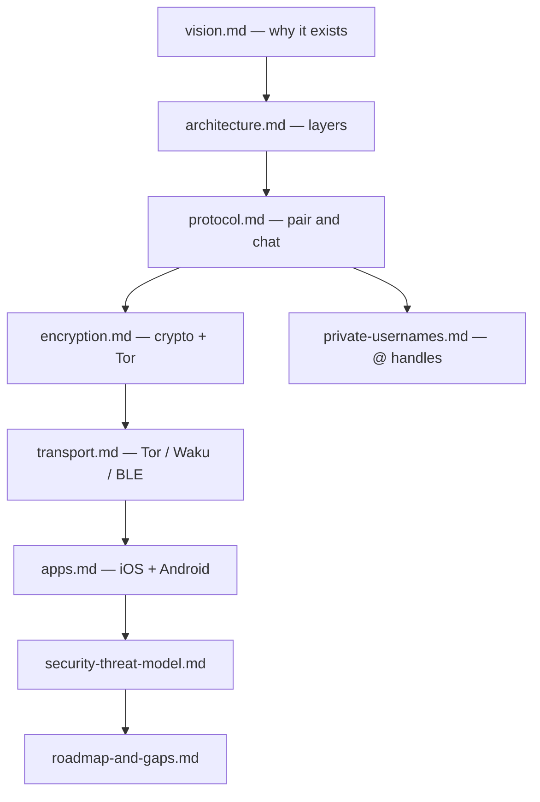
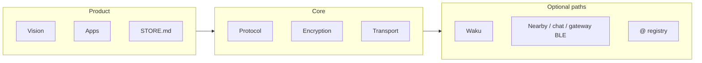

# Horus documentation

Read in this order if you are new to the project:

1. [vision.md](vision.md) — why Horus exists and what “done” means  
2. [architecture.md](architecture.md) — how the repo is layered  
3. [protocol.md](protocol.md) — pairing and messaging lifecycle  
4. [encryption.md](encryption.md) — cryptography and production Tor path  
5. [transport.md](transport.md) — Tor, Waku, BLE, outbox  
6. [apps.md](apps.md) — iOS and Android clients  
7. [security-threat-model.md](security-threat-model.md) — adversaries and limits  
8. [roadmap-and-gaps.md](roadmap-and-gaps.md) — vision vs v0.7; path to prod scale
9. [private-usernames.md](private-usernames.md) — private `@` handles (commitment / ZK)  

### Supporting docs

| File | Topic |
|------|--------|
| [setup.md](setup.md) | Tooling, sync config, build scripts |
| [adapters.md](adapters.md) | FFI bridges (JNI / Swift / C++) |
| [integration.md](integration.md) | Wiring a custom UI to the protocol |
| [relay.md](relay.md) | Dev HTTP relay |
| [../infrastructure/relays/wake-relay/README.md](../infrastructure/relays/wake-relay/README.md) | Optional content-free APNs/FCM wake ping |
| [waku.md](waku.md) | Hybrid BlindPipe details |
| [https://github.com/horus-chat/horus-protocol/blob/main/docs/nearby-ble.md](https://github.com/horus-chat/horus-protocol/blob/main/docs/nearby-ble.md) | Nearby invite BLE |
| [https://github.com/horus-chat/horus-protocol/blob/main/docs/chat-ble.md](https://github.com/horus-chat/horus-protocol/blob/main/docs/chat-ble.md) | BLE chat frames |
| [https://github.com/horus-chat/horus-protocol/blob/main/docs/gateway-ble.md](https://github.com/horus-chat/horus-protocol/blob/main/docs/gateway-ble.md) | Phone uplink gateway |
| [../apps/mobile/docs/STORE.md](../apps/mobile/docs/STORE.md) | Store listing notes |

The original product brief lives at [`../instructions.txt`](../instructions.txt) (historical intent). Reality tracking is in [roadmap-and-gaps.md](roadmap-and-gaps.md).
