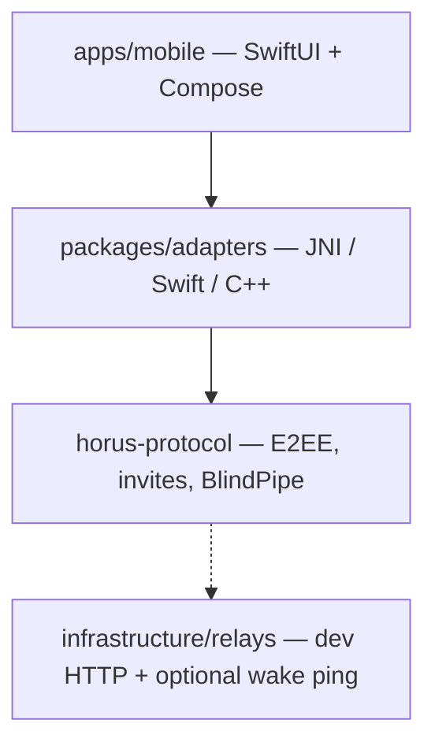
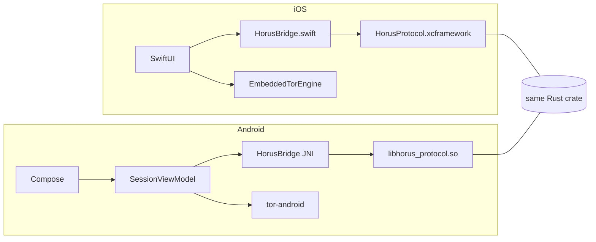
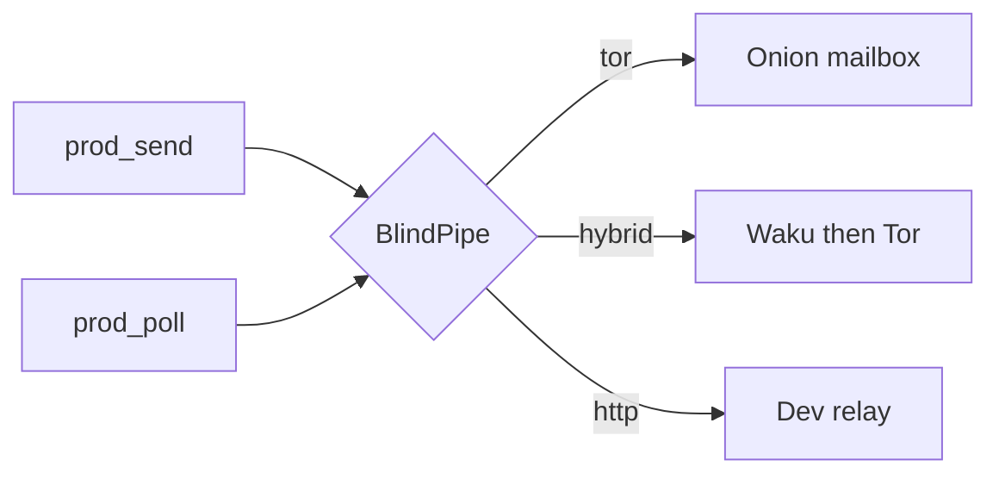
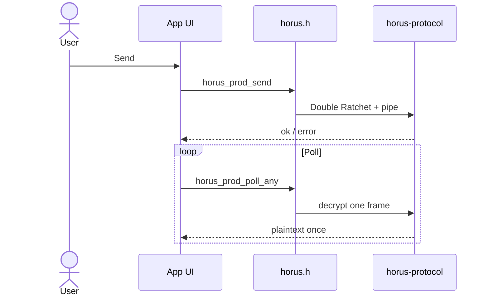
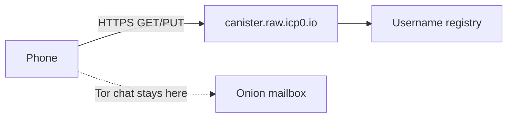

# Architecture

## Layers

UI never implements crypto. It calls `horus.h`. Relays never see plaintext.

See also: [vision.md](vision.md) · [protocol.md](protocol.md) · [transport.md](transport.md) · [apps.md](apps.md).

## Transports

| `transport` | Pipe |
|-------------|------|
| `hybrid` | `HybridPipe`: sealed bridge prefer, Tor fallback (**app default**) |
| `tor` | Onion mailbox (`ProdPipe`) |
| `http` | Dev `RelayClient` |

Apps keep using `prod_send` / `prod_poll` when Tor/hybrid is active.

## UI → protocol mapping

| UI action | Protocol call |
|---|---|
| First launch | `horus_init(config)` (+ Tor engine outside FFI) |
| Create invite | `horus_create_invite()` |
| Paste / redeem invite | `horus_connect` / accept invite helpers |
| Accept peer | `horus_accept_incoming()` |
| Send message | `horus_prod_send(chat_id, text)` |
| Poll | `horus_prod_poll` / `horus_prod_poll_any` |

All crypto and relay logic stays in Rust. UI apps only call the FFI surface (`horus.h`).

## Themes

Default tokens: `packages/core/themes/default.json` (and app-local `HorusColors`).

## Blockchain

ICP Motoko `@` registry (nullifier + commitment). **Messages never on-chain.** Code: `packages/blockchain/canister`.

