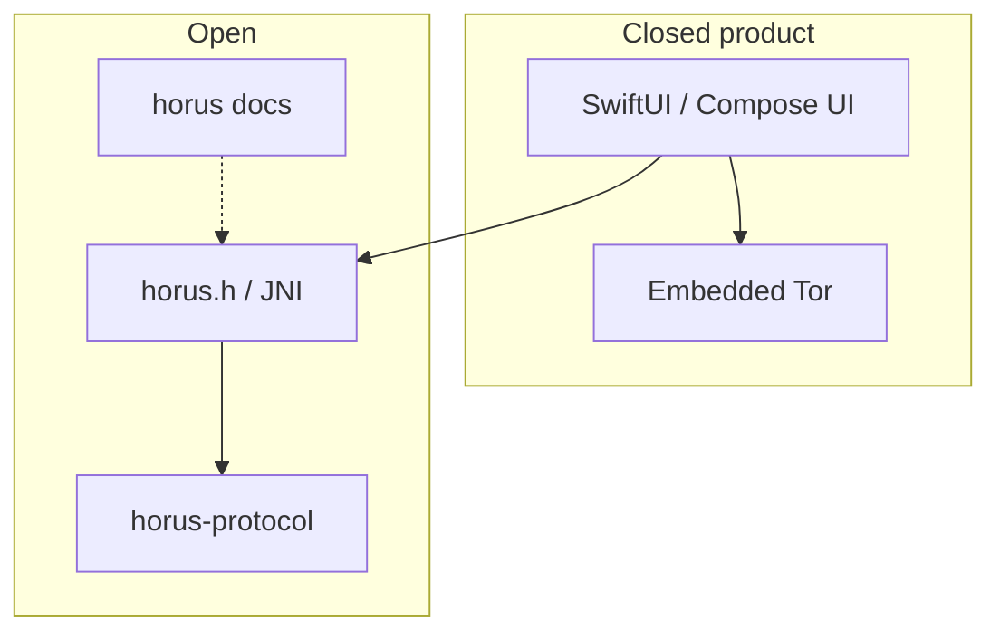

# Clients

Official **Horus** iOS and Android apps are **closed-source**. They embed [horus-protocol](https://github.com/horus-chat/horus-protocol) and Tor on-device. This document is for people building **alternate clients** or reviewing how a UI should talk to the protocol.

## Responsibilities split

| Layer | Owns |
|-------|------|
| UI | Screens, notifications UX, Tor lifecycle, outbox UI |
| FFI / protocol | Crypto, invites, pipes, receipts, groups |
| Relays | Opaque blobs or wake tokens only |

UI **must not** implement Double Ratchet or parse mailbox ciphertext.

## Integrator checklist

1. Link `horus-protocol` (`horus.h`). See [ffi.md](ffi.md).  
2. Call `horus_init` with a config that sets `transport` (`tor` | `http` | `hybrid`).  
3. Run Tor (prod) or [horus-dev-relay](https://github.com/horus-chat/horus-dev-relay) (lab).  
4. Follow [message-flow.md](message-flow.md): create/redeem → Accept → `prod_send` / `prod_poll_any`.  
5. Never `prod_send` to a `group-*` id — use sender-key APIs.  
6. Treat invites as secrets until burned.

## What stays private

Store signing, APNs `.p8`, FCM service accounts, official branding, and the SwiftUI/Compose source.

## Related

- [getting-started.md](getting-started.md)  
- [architecture.md](architecture.md)  
- [threat model](security-threat-model.md)  
