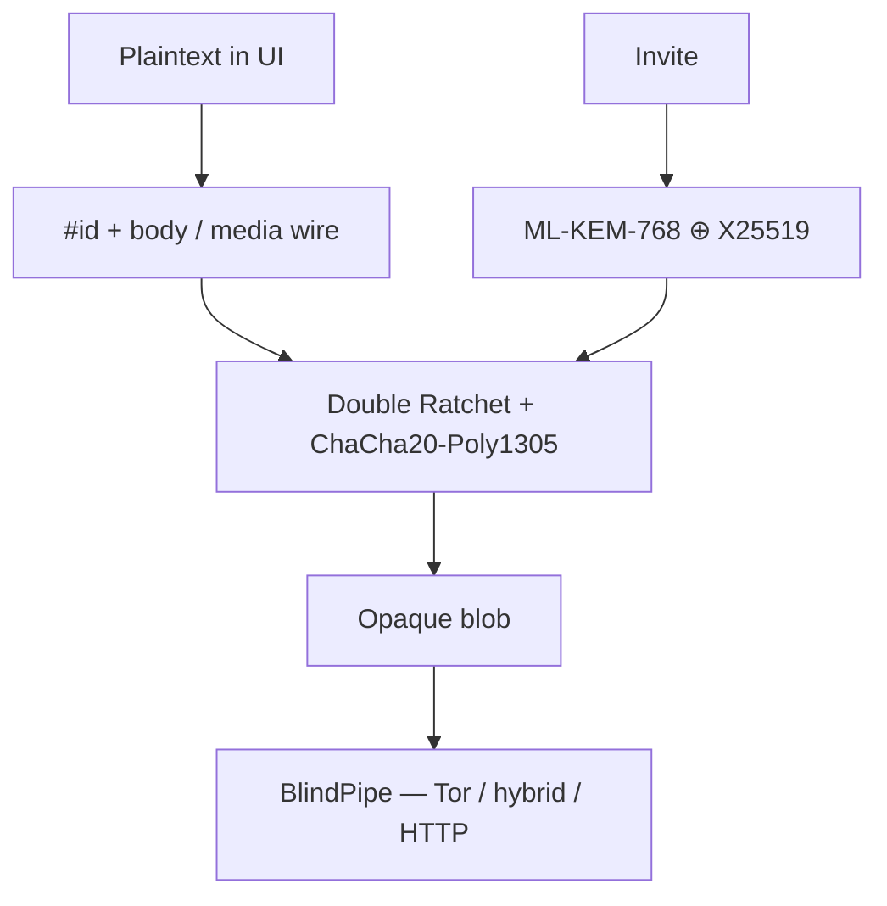
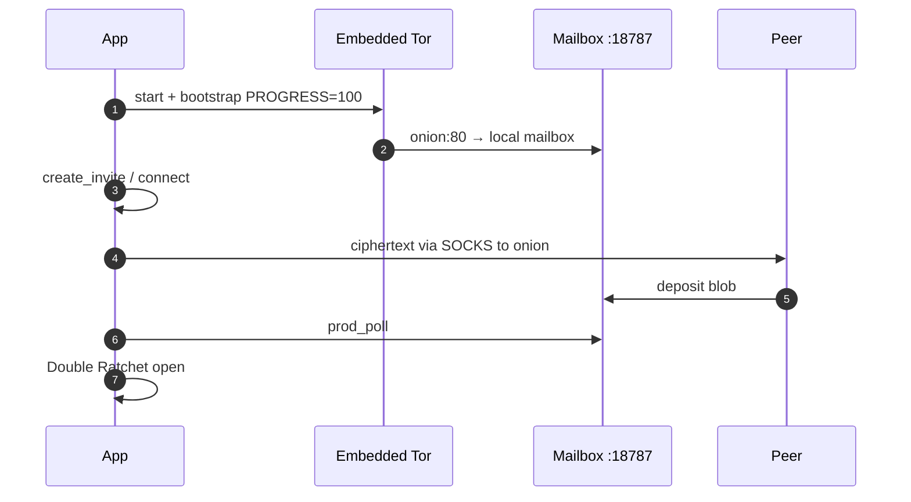

# Encryption & production transport (v0.7+)

Companion docs: [protocol.md](protocol.md) · [transport.md](transport.md) · [security-threat-model.md](security-threat-model.md).

## Security

| Layer | Tech |
|---|---|
| 1:1 | Signal-style Double Ratchet + ChaCha20-Poly1305 |
| Groups | Sender-key ratchet (`horus.gsk.v1:`) inside 1:1 fan-out + mesh intros; MLS later |
| Handshake | PQ hybrid (ML-KEM-768 ⊕ X25519) |
| Invites | v2 single-use + 24h TTL; burned after accept |
| Accept gate | Creator must accept before chat is live |
| Transport (prod) | **Hybrid bridge first**, Tor onion mailbox fallback — see [waku.md](waku.md) / [transport.md](transport.md) |
| Transport (tor) | Embedded Tor onion mailbox only |
| Transport (dev) | Local HTTP relay |
| Persistence | `horus_set_data_dir` + save/load identity & sessions |
| Media | Chunk seal/open + timed text + call-signal JSON |
| Calls (apps) | iOS: WebRTC voice + sealed signaling; Android: sealed media frames; **no video** in current shipping builds |
| Blockchain | Optional ICP username **commitment** only (never messages) |



## Production flow (embedded Tor)



1. App launch starts in-process Tor and local mailbox `127.0.0.1:18787`
2. Tor publishes onion:80 → mailbox; protocol gets SOCKS `127.0.0.1:<socks>` + onion hostname
3. Creator invite → peer `connect` + `prod_announce` → creator `prod_poll` + `accept_incoming`
4. Both: `prod_send` / `prod_poll` (ciphertext only over Tor)

### iOS

- Fetch binary: `./infrastructure/scripts/fetch_tor_ios.sh`
- Engine: [`EmbeddedTorEngine.swift`](../apps/mobile/ios/Horus/Horus/Services/EmbeddedTorEngine.swift)
- ObjC API + `tor.xcframework` from [iCepa/Tor.framework](https://github.com/iCepa/Tor.framework) (MIT)

### Android

- Guardian [`tor-android`](https://github.com/guardianproject/tor-android) + `jtorctl`
- [`EmbeddedTorBootstrap.java`](../packages/adapters/android/EmbeddedTorBootstrap.java)

### Desktop / CI

- `./infrastructure/scripts/tor_bootstrap.sh` (system `tor`) still available

## Limits

Inbound onion delivery requires the app process to be alive unless the recipient enabled **Wake when closed** (content-free APNs/FCM ping). iOS can still delay or drop that ping.

```bash
./infrastructure/scripts/fetch_tor_ios.sh
cd horus-protocol && cargo test -- --test-threads=1
cd apps/mobile/ios && ./generate_xcode.sh
./infrastructure/scripts/build_protocol.sh host
```
