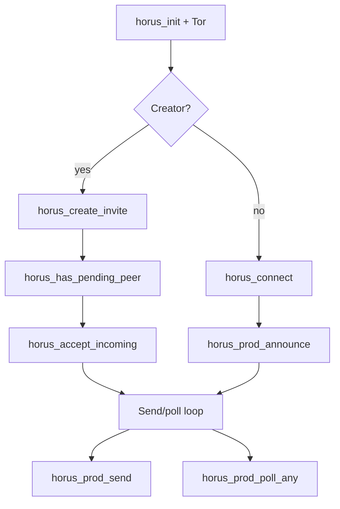

# FFI reference (`horus.h`)

Public C API from [horus-protocol/include/horus.h](https://github.com/horus-chat/horus-protocol/blob/main/include/horus.h).  
Strings returned as `char *` must be freed with `horus_free_string` unless documented otherwise.

Official apps and third-party clients should treat this header as the **stability surface**.

## Lifecycle & storage

| Function | Purpose |
|----------|---------|
| `horus_set_data_dir` | Where identity / state files live |
| `horus_set_storage_key` | Encrypt state at rest (key material) |
| `horus_save` / `horus_load` | Persist / restore protocol state |
| `horus_init` | Parse `config.json` (transport, relays, …) |
| `horus_version` | Library version string |

## Pairing

| Function | Purpose |
|----------|---------|
| `horus_create_invite` | Burnable `horus://invite/…` |
| `horus_connect` | Joiner redeem invite |
| `horus_accept_invite` | Redeem against an HTTP relay URL (dev) |
| `horus_has_pending_peer` | Creator: hello waiting |
| `horus_accept_incoming` | Creator unlock chat |
| `horus_has_route` / `horus_is_ready` | Routing / accept gates |
| `horus_list_contacts` | JSON contact list |
| `horus_active_chat_id` | Current chat |
| `horus_select_chat` | Switch active 1:1 |
| `horus_remove_contact` | Drop a route |

## Production Tor path

| Function | Purpose |
|----------|---------|
| `horus_set_onion` | Publish our onion hostname into protocol |
| `horus_start_mailbox` | Bind local mailbox (returns info string) |
| `horus_prod_announce` | Announce after redeem |
| `horus_prod_send` | Encrypt + send 1:1 text (never `group-*`) |
| `horus_prod_send_opaque` | Sealed / opaque wire (no DR) |
| `horus_prod_poll` | Poll one chat |
| `horus_prod_poll_any` | Poll any ready chat |
| `horus_last_error` | Last error string |

## Dev HTTP relay helpers

| Function | Purpose |
|----------|---------|
| `horus_send` / `horus_send_to_relay` | Lab send paths |
| `horus_poll_relay` / `horus_poll_inbound` | Lab poll paths |
| `horus_dev_relay_public_key` | Dev relay identity helper |
| `horus_public_key` | Our identity pubkey (b64) |

## Username registry

| Function | Purpose |
|----------|---------|
| `horus_registry_claim` | Claim `@name` (nullifier + commitment) |
| `horus_registry_resolve` | Resolve findable contact blob |
| `horus_registry_taken` | Availability check |
| `horus_registry_lookup` | Deprecated alias of resolve |

## Media / calls / timed

| Function | Purpose |
|----------|---------|
| `horus_seal_media` / `horus_open_media` | Chunked sealed media |
| `horus_pack_timed` / `horus_timed_alive` | Disappearing helpers |
| `horus_pack_call_signal` | Call signaling pack |

## Sender-key groups

Never `horus_prod_send` to a `group-*` id. Fan-out is 1:1 DR of sealed `gsk` bodies.

| Function | Purpose |
|----------|---------|
| `horus_sk_init` | Start sender chain for `group_id` |
| `horus_sk_export` / `horus_sk_import` | SKDM distribute / accept |
| `horus_sk_seal` / `horus_sk_open` | Seal / open group body |
| `horus_sk_rotate` / `horus_sk_clear` | Rotate / wipe |
| `horus_sk_sender_id` | This install’s sender id |

## Typical client loop

## Related

- [message-flow.md](message-flow.md)  
- [protocol.md](protocol.md)  
- [getting-started.md](getting-started.md)  
