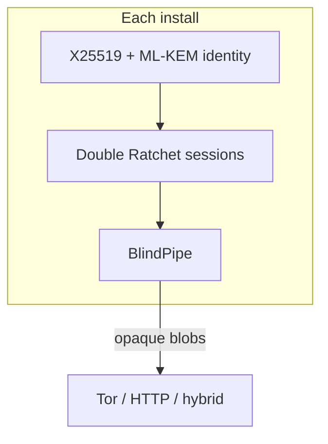

# Getting started

This guide is for **protocol reviewers and client integrators**. Official Horus apps are closed-source; you build against the open stack.

## What you need

- Rust (stable) via [rustup](https://rustup.rs/)
- Git
- Optional: a Tor SOCKS endpoint if you exercise the production `tor` transport outside unit tests

## Clone the open stack as siblings

```bash
mkdir horus-workspace && cd horus-workspace
git clone https://github.com/horus-chat/horus-username-registry.git
git clone https://github.com/horus-chat/horus-dev-relay.git
git clone https://github.com/horus-chat/horus-protocol.git
git clone https://github.com/horus-chat/horus.git   # docs only
```

Layout expected by Cargo path deps:

```text
horus-workspace/
  horus-username-registry/   # registry/ crate
  horus-dev-relay/
  horus-protocol/
  horus/                     # documentation
```

## Run the test suite

```bash
cd horus-username-registry/registry && cargo test
cd ../../horus-dev-relay && cargo test
cd ../horus-protocol && cargo test --lib -- --test-threads=1
```

That exercises crypto, invites, mailbox lease/ACK, and hybrid pipe mocks **without** a phone.

## Mental model (5 minutes)



1. **Create invite** → share `horus://invite/…` (or BLE).  
2. **Joiner redeems** → hello lands on creator mailbox.  
3. **Creator Accept** → session live; buffered ciphertext flushes.  
4. **Both** `prod_send` / `prod_poll` on the **creator onion** rendezvous (reversed queues).

Deep dive: [message-flow.md](message-flow.md) · [protocol.md](protocol.md).

## Run a local HTTP mailbox

```bash
cd horus-dev-relay
cargo run
# listens on http://127.0.0.1:8787 by default
```

Point a client `config.json` at `"transport": "http"` and `"relays": ["http://127.0.0.1:8787"]` for lab work. Production path is `"transport": "tor"` with on-device Tor.

Details: [relay.md](relay.md) · [transport.md](transport.md).

## Link the FFI from your app

1. Build `horus-protocol` as `cdylib` / `staticlib` for your target.  
2. Include [`horus.h`](https://github.com/horus-chat/horus-protocol/blob/main/include/horus.h).  
3. Call `horus_init` → invite/connect → `horus_prod_send` / `horus_prod_poll_any`.  

API map: [ffi.md](ffi.md). Design constraints: [architecture.md](architecture.md).

## Read next

| Goal | Doc |
|------|-----|
| Understand trust boundaries | [security-threat-model.md](security-threat-model.md) |
| Wire formats / BLE | [horus-protocol docs](https://github.com/horus-chat/horus-protocol/tree/main/docs) |
| `@` handles | [private-usernames.md](private-usernames.md) |
| Terms | [glossary.md](glossary.md) |
