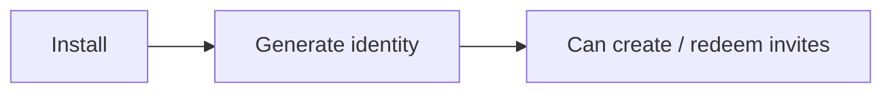
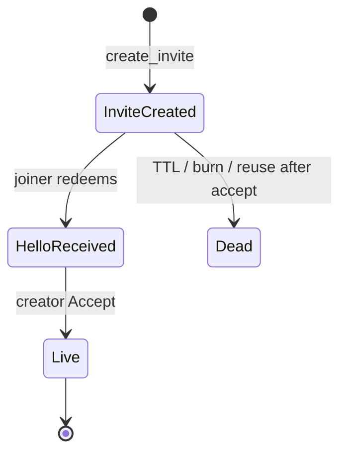
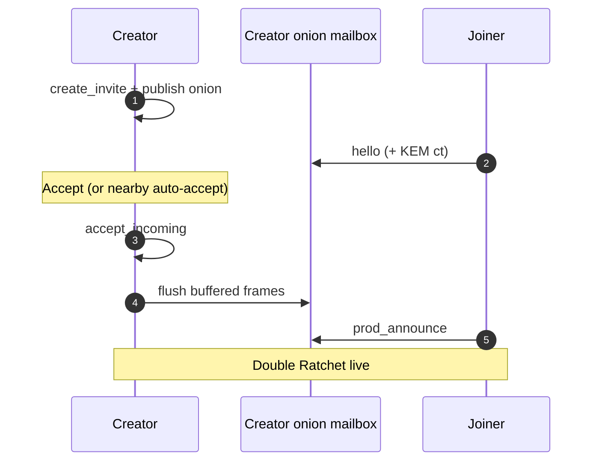
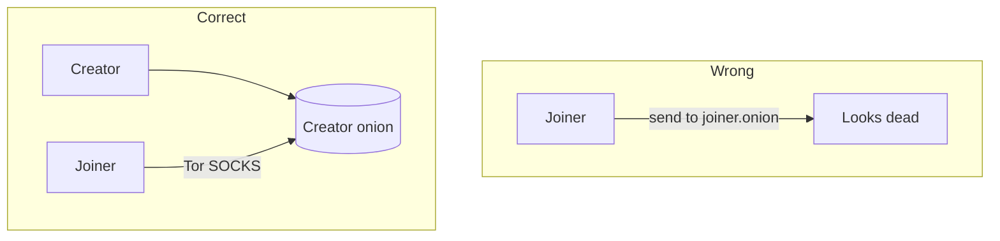
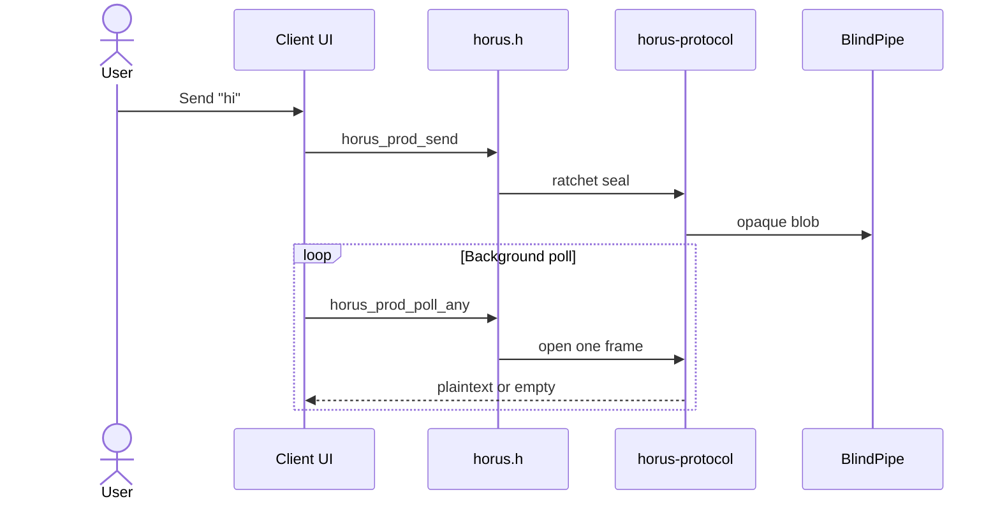

# Message flow — invite to ciphertext

One narrative for how two devices go from strangers to a live encrypted chat, then exchange messages. Normative detail lives in [protocol.md](protocol.md) and [encryption.md](encryption.md).

## 1. Local identity

On first launch the device creates:

- X25519 identity keypair  
- ML-KEM encapsulation key (PQ hybrid on invite)

There is **no** Horus account server. Keys stay on device (`horus_set_data_dir` / save / load).



## 2. Creator makes a burnable invite

`horus_create_invite` → URI:

```text
horus://invite/<base64url-json>
```

Includes invite id, creator onion, queue names, expiry, optional KEM encapsulation key.

Share via link, QR, or [Nearby BLE](https://github.com/horus-chat/horus-protocol/blob/main/docs/nearby-ble.md).



## 3. Joiner redeems (hello)

Joiner calls connect/redeem. A JSON **hello** (`horus: "hello"`) reaches the **creator’s** onion mailbox (pubkey, invite id, optional KEM ciphertext, joiner onion).

Creator must **Accept** (`horus_accept_incoming`) before the chat unlocks. Pre-accept ciphertext is **buffered**, not dropped.



## 4. Rendezvous rule (critical)

Both peers use the **creator onion + reversed queues** as the production rendezvous. The joiner polls/sends via Tor SOCKS to the creator mailbox.

**Do not** treat the joiner onion as the primary delivery path for 1:1 chat — that caused cross-platform “messages never arrive” bugs historically.



## 5. Send / poll loop

Apps call the same FFI regardless of transport:

| Step | FFI | What happens |
|------|-----|----------------|
| Send | `horus_prod_send(chat_id, text)` | DR encrypt → `BlindPipe` posts opaque blob |
| Poll | `horus_prod_poll` / `horus_prod_poll_any` | Fetch blob → DR decrypt → plaintext **once** |



Transport modes (`tor` / `http` / `hybrid`): [transport.md](transport.md).

## 6. Offline & wake

- Local **outbox** until the pipe durably accepts  
- Optional relay store-and-forward (lease + ACK, TTL ~7 days on dev/hybrid paths)  
- Optional **wake relay**: content-free APNs/FCM ping (`wake_id` only) — ciphertext still on Tor  

## 7. Multi-contact & groups

Contacts are keyed by **invite id**. Groups fan out sealed sender-key payloads over **1:1** Tor routes — never `prod_send` to a `group-*` mailbox. See [protocol.md](protocol.md#groups).

## Related

- [ffi.md](ffi.md) — which call to use  
- [architecture.md](architecture.md) — where trust ends  
- [glossary.md](glossary.md) — term definitions  
