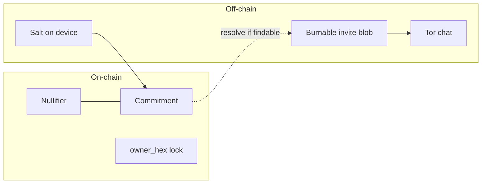
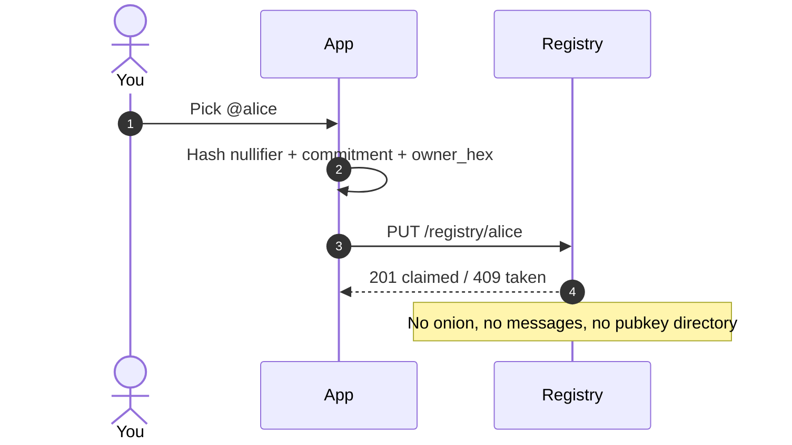
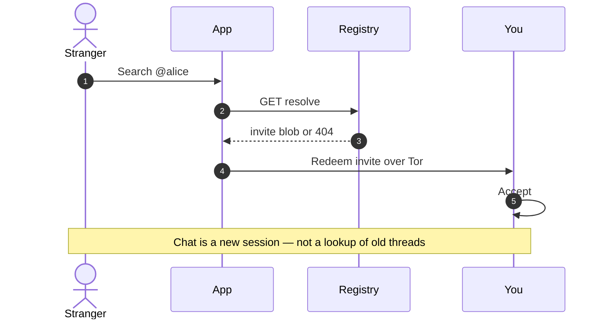
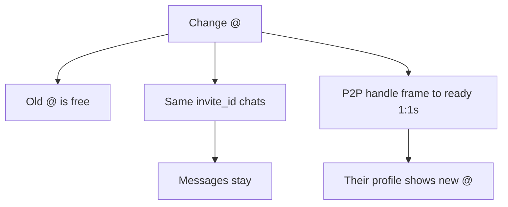

# Private usernames (@handles)

Horus wants Telegram-style `@search` **without** a global plaintext map of `username → identity`.

The Motoko canister (`packages/blockchain/canister`) stores a **nullifier + commitment**,
not plaintext `username → pubkey`. `resolve` returns a findable **invite blob** only.
Phones call ICP’s HTTP gateway (`https://<id>.raw.icp0.io`) — no Horus VPS.

## Threat model for “untraceable @”

| Attacker sees | Must learn |
|---------------|------------|
| On-chain registry | **Not** your onion, not your device, not that you are user X |
| Someone searching `@alice` | **Not** a public log of who searched whom (if avoidable) |
| Successful DM start | Only the two parties learn each other’s messaging endpoints |

“Blockchain encryption” alone does **not** give privacy: encrypting a public map still needs a decryption key, and if the chain can decrypt for search, so can anyone with that key.

## Recommended design (commitment + selective disclose)

### Claim `@alice`

1. Device holds identity keypair `(sk, pk)` and optional onion / invite material.
2. Pick a username `u = "alice"`.
3. Compute a **commitment**:
   - `H = Hash(normalize(u) ‖ pk ‖ salt)` or a ZK-friendly Pedersen/Poseidon commitment.
4. Publish on ICP (or L2):
   - `commitment` (or nullifier-style tag)
   - **not** plaintext `pk`
   - optional rate-limit / stake proof
5. Prove in zero knowledge: “I know `sk` for `pk` and `u` such that commitment verifies, and `u` is fresh.”

Uniqueness: either uniqueness of `Hash(u)` in a nullifier set (reveals that `@alice` is taken, which is usually OK) **or** a private set membership tree (harder UX: “taken” is fuzzy).

### Search / resolve `@alice` → start chat

Two viable product modes:

**A. Intentional reveal (recommended for v1)**  
Searcher already somehow got `@alice` (typed, shared). Resolution is an **interactive** protocol:

1. Searcher asks registry / relay for a **blind** or **PIR** response for `Hash(u)`.
2. Owner (or a sealed resolver) returns an **encrypted invite blob** only decryptable by a one-time ECDH with the searcher’s ephemeral key — or returns nothing.
3. No public `pk` ever sits next to `u` on-chain.

**B. Public resolve with ZK**  
On-chain stores only commitments. A prover publishes a ZK proof “commitment opens to this `pk` for username `u`” when **they choose** to be findable. Still leaks “this `pk` is `@alice`” to anyone who sees the proof — same as Telegram’s public @.

True “nobody can link `@` to the person” **and** “anyone can search and message `@`” are in tension. Pick one:

| Goal | Consequence |
|------|-------------|
| Anyone can find `@alice` and message her | At least the resolver learns a contact endpoint (invite/onion/pk) |
| Nobody can link `@alice` to an identity | Search must fail for strangers, or use introduction codes / mutual friends |

**Horus fit:** store **commitments + uniqueness nullifiers** on ICP; keep **messaging endpoints off-chain**; deliver contact via a **handle invite** (multi-use rendezvous; each seeker derives an isolated channel) after resolve. Never put onions or chat history on-chain. Pairing invites (QR/link) remain single-use and burnable — do not reuse them as registry blobs.

## What we will not do

- Plaintext `username → pubkey` on mainnet.
- Putting messages or social graphs on the blockchain.
- Claiming ZK privacy while shipping open lookup.

## Implementation order

1. Spec + commitment registry + uniqueness. **Done:** Motoko canister + client hashes (`UsernameCommitment`).
2. Client: claim `@` in Settings; search `@` → resolve → invite redeem. **Done** (ICP HTTP gateway — no LAN).
3. Mainnet: `cd packages/blockchain/canister && ./deploy.sh mainnet`, rebuild apps. **Live:** `pvxrg-rqaaa-aaaau-ag5na-cai`.
4. Optional later: PIR / oblivious resolve; ICRC NFT wrapper.
