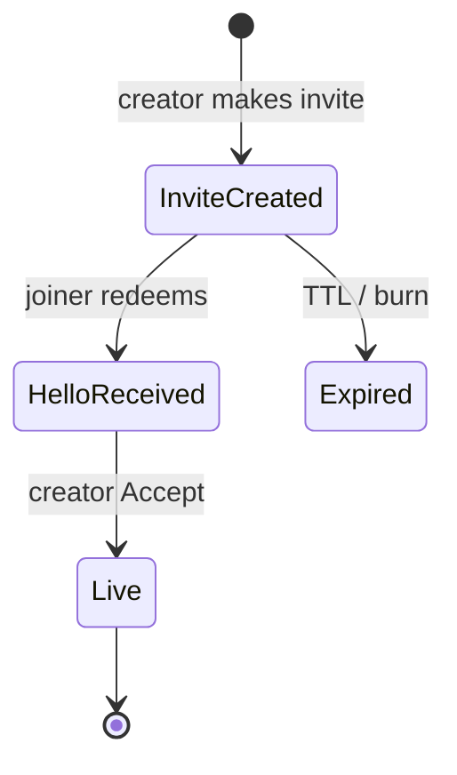
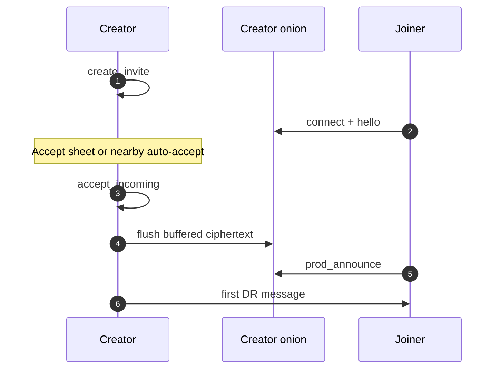
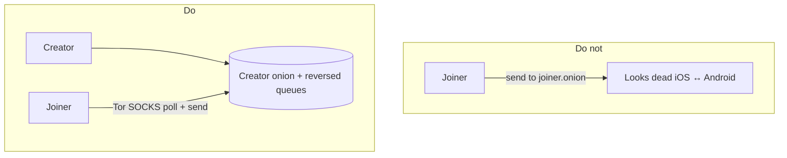
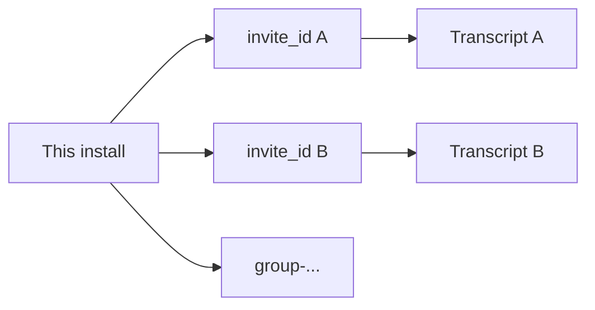
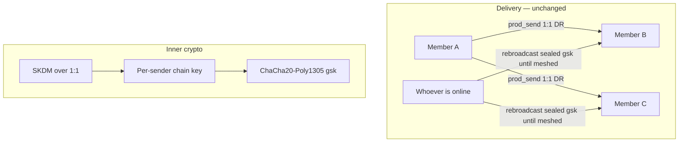

# Protocol — how Horus messaging works

This describes the **implemented** protocol in `horus-protocol` (v0.7). Crypto details: [encryption.md](encryption.md). Transports: [transport.md](transport.md).

## Roles

| Role | Who | Notes |
|------|-----|--------|
| **Creator** | Makes the invite | Must **Accept** before chat unlocks |
| **Joiner** | Redeems the invite | Can send first after redeem; DR roles follow invite |

Readiness (`is_ready`): peer key known **and** creator has accepted.



## Identity

- On first run the device generates an X25519 identity (+ ML-KEM encapsulation key for PQ hybrid).  
- Keys live in the app data dir (`horus_set_data_dir` / save / load).  
- There is **no** Horus account server.

## Invite (v2)

Two flavours share the wire format:

| Kind | `handle` | Use | Lifetime |
|------|----------|-----|----------|
| **Pairing invite** | `false` | QR / link / nearby | Single-use, ~24h TTL, burns after Accept |
| **Handle invite** | `true` | Published to `@` registry | Multi-use, never expires; each seeker derives a private channel via `HandleChannel` |

URI:

```text
horus://invite/<base64url(JSON)>
```

Typical fields: `invite_id`, creator `onion`, queue names, `expires_at_ms` (`0` = never for handles), `single_use`, `kem_ek_b64`, `handle`.

Ways to move a **pairing** invite:

- Paste / deep link / QR  
- Nearby BLE chunked transfer ([nearby-ble.md](https://github.com/horus-chat/horus-protocol/blob/main/docs/nearby-ble.md))

Do **not** publish a pairing invite as a handle blob — that caused “contact link out of date” and shared threads between seekers. Use `horus_create_handle_invite` / `create_handle_invite()` for the registry.

```mermaid
flowchart LR
    C[Creator] -->|horus://invite/...| Link[Link / QR]
    C -->|chunked GATT| BLE[Nearby BLE]
    Link --> J[Joiner]
    BLE --> J
    J -->|hello + optional KEM ct| C
    Reg[@ registry] -->|handle invite| S1[Seeker A]
    Reg -->|same blob| S2[Seeker B]
    S1 -->|HandleChannel A| CA[Private chat A]
    S2 -->|HandleChannel B| CB[Private chat B]
```

## Handshake (hello)

Joiner sends a JSON hello (field `horus: "hello"`) including pubkey, invite id, optional KEM ciphertext, and joiner onion.  

Creator must call **accept incoming** before the chat is live. Pre-accept ciphertext is buffered and flushed on accept (not dropped).



## Session crypto

After accept, both sides run a **Double Ratchet** with PQ-hybrid root material from the invite handshake. Application plaintext never goes on the wire.

Wire helpers used by apps:

- Message id prefix for receipts: `#id\ntext`  
- Receipts: `horus.rcpt.v1:d|r:<id>`  
- Calls: `horus.call.v1:` / `horus.media.v1:` sealed chunks  

## Delivery model (production)

Both peers use the **creator’s onion mailbox** as rendezvous (reversed queues). Joiner polls the creator onion over Tor SOCKS. Sending to the joiner onion as primary path is incorrect and was a past cross-platform bug.



Apps call:

| FFI | Meaning |
|-----|---------|
| `horus_create_invite` | New burnable **pairing** invite |
| `horus_create_handle_invite` | Multi-use **handle** rendezvous blob for `@` registry |
| `horus_connect` / accept invite | Joiner redeem |
| `horus_prod_announce` | Announce on pipe after redeem |
| `horus_accept_incoming` | Creator accept |
| `horus_prod_send` | Encrypt + send blob (1:1 only — never a `group-*` id) |
| `horus_prod_poll` / `prod_poll_any` | Decrypt inbound (plaintext once) |
| `horus_sk_*` | Sender-key init / SKDM / seal / open / rotate |

`BlindPipe` implementations: Tor mailbox, HTTP dev relay, hybrid Waku→Tor.

## Multi-contact

Contacts are keyed by invite id. Creating a new invite must not wipe other contacts. `horus_remove_contact` clears a route.



## Groups

Groups keep **1:1 Tor delivery** (`prod_send` to member invite ids — never to a `group-*` mailbox). Inner chat bodies use a **Signal-style sender-key ratchet** (`horus.gsk.v1:`). Control frames (typing / edit / react / SKDM) stay inside each member’s Double Ratchet.



Each install holds one **send chain** per `group_id` (32-byte chain key, generation, `n`) and a **recv chain** per sender. Message key = HKDF(chain); then the chain ratchets. Gaps use skipped message keys (`MAX_SKIP`), same idea as 1:1.

**SKDM** (`horus.skdm.v1:`) distributes the current send seed + generation + sender id. On member **remove**, remaining devices `sk_rotate` (new generation) and re-export SKDM so a removed member is not on the new chain.

Honest limit: members start with a 1:1 only to whoever invited them. **Mesh intros** (`horus.gneed.v1:` / `horus.gintro.v1:`) create hidden 1:1 sessions between members so chat still fans out if the original creator is offline. Until that pair exists, whoever is online still forwards sealed `gsk` blobs. The hub can see SKDM seeds; it forwards **sealed** chat bodies without parsing text. MLS (full group membership crypto without a hub) is still later.

Any member can add a contact they already have (after create). Leave wipes this device; **Delete group for everyone** sends `horus.gend.v1:` so members wipe transcript + sender-key state.

Legacy `horus.gmsg.v1:` plaintext-inside-DR frames are still parsed so older groups do not go mute.

FFI: `horus_sk_init` / `export` / `import` / `seal` / `open` / `rotate` / `clear`. `horus_select_chat` restores the active 1:1 after minting a mesh invite.

## Source map

| Concern | Location |
|---------|----------|
| FFI | `horus-protocol/src/ffi.rs`, `include/horus.h` |
| Invite | `invite.rs` |
| Handshake | `handshake.rs` |
| Ratchet | `crypto/session.rs` |
| Sender keys | `crypto/group.rs` |
| Prod Tor path | `prod.rs`, `tor.rs`, `mailbox.rs` |
| Hybrid | `waku.rs` |
| Persistence | `persist.rs` |
