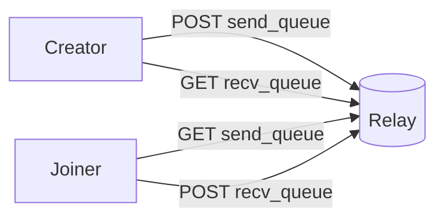

# Dev Relay

## Status

- Local/prod binary: `https://github.com/horus-chat/horus-dev-relay`
- Transport: HTTP (+ `/waku/v1/…` bridge paths)
- Storage: in-memory queues with optional disk persist (`HORUS_RELAY_STATE`)
- Privacy: opaque encrypted blobs only
- Delivery: **lease + ACK** (not delete-on-read). Unacked leases redeliver after ~5 minutes.
- Cleanup: TTL pruning (default **7 days**, `HORUS_RELAY_TTL_SECS`)

## Run

```bash
cargo run --manifest-path https://github.com/horus-chat/horus-dev-relay/Cargo.toml
```

Default URL:

```text
http://127.0.0.1:8787
```

## API

```text
GET  /health
POST /queues/<queue-id>
GET  /queues/<queue-id>          # returns body + X-Horus-Lease
POST /ack/<lease-id>             # drop leased message
POST /waku/v1/queues/<queue-id>
GET  /waku/v1/queues/<queue-id>
POST /waku/v1/ack/<lease-id>
```

`POST` stores an encrypted blob. `GET` **leases** the oldest blob; client must `POST /ack/{id}` after receiving it.

## Android

Dev config points Android to:

```json
"relays": ["http://127.0.0.1:8787"]
```

For a physical phone, replace `127.0.0.1` with your Mac LAN IP.

## Invite Queues

Invites now carry:

- sender public key
- send queue
- receive queue

Format:

```text
horus://invite/<base64url-json>
```

When someone accepts an invite, queues are reversed:

- creator sends to `send_queue`
- accepter polls `send_queue`
- accepter sends to `recv_queue`
- creator polls `recv_queue`



## Verified

- Relay unit tests: lease/ACK + redelivery
- Protocol client ACKs after Waku/HTTP poll
