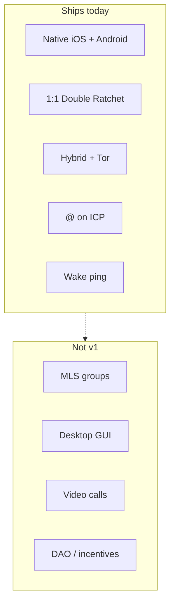

# Roadmap and gaps — vision vs v0.7

This maps the original full-prod vision onto **what the open stack ships today**, and what is still missing for “final full prod scale.”

## Snapshot

| Layer | Vision | Today (protocol **0.7** / shipping apps) |
|-------|--------|--------------|
| Clients | One Flutter (or Telegram forks) for all OS | **Native iOS + Android**; no Flutter app; no desktop GUI |
| Encryption | Signal + MLS groups + PQ | **Double Ratchet + ML-KEM hybrid** for 1:1; **sender-key groups** (MLS later) |
| Transport | SimpleX queues + Waku + onion/mix | **Hybrid bridge default** + Tor onion fallback; BLE gateway |
| Identity | Local keys + optional ZK username | Local keys; **ICP Motoko `@` locks** (handle invites; mainnet canister in prod config) |
| Calls | WebRTC E2EE + P2P when possible | **iOS WebRTC voice** + sealed signaling; Android sealed media; **no video** |
| Push | Encrypted APNs / UnifiedPush | **Content-free** local notifies + wake relay (**on by default** for new installs) |
| Offline | Offline-first + mesh | **Outbox + bridge lease/ACK + BLE gateway** |
| Blockchain | Incentives, DAO, RLN spam | **Username registry only** (no on-chain messages) |
| Monetization | Token / premium | **None** |
| Audits | Independent audits before launch | **Not done** |

---

## A. What is already in good shape

- Local identity, burnable **pairing** invites, accept gate  
- Multi-use **handle invites** for `@` registry + per-seeker channels  
- 1:1 E2EE over hybrid bridge + Tor fallback  
- Receipts, multi-contact, typing/reactions, App Lock, GIF wire  
- Embedded Tor on iOS and Android  
- iOS WebRTC voice + CallKit; Android sealed call media  
- Nearby BLE pairing  
- Operated hybrid bridge + wake relay  
- Protocol test suite + mobile outbox/mesh helpers  
- Sender-key groups with mesh intros  

---

## B. Missing for the intended **full prod scale**

Grouped by the original outline.

### 1. Product / UX completeness

- [ ] Typing indicators, message edit/delete sync, reactions  
- [ ] Rich media gallery, voice notes UX polish, file transfer productization  
- [ ] Multi-device sync for one identity  
- [ ] Biometrics / passphrase lock for local keys  
- [ ] Multiple independent profiles per device (vision)  
- [ ] Desktop + tablet polished clients (macOS/Windows/Linux)  
- [ ] Huawei / Harmony push path (vision)  
- [ ] Store presence: signed release tracks, privacy nutrition labels, support site  

### 2. Protocol & crypto to vision

- [ ] **MLS groups** (or equivalent) with invite-link groups and efficient fanout  
- [ ] Disappearing messages **enforced** end-to-end (TTL helpers exist; product enforcement incomplete)  
- [ ] Formal PQ defaults story + migration policy  
- [ ] Independent **security audit** of protocol + mobile bridges  

### 3. Network at scale

- [ ] **Harden / multi-node** public bridge fleet (single operated bridge ships today)  
- [ ] Multi-hop mix policy beyond single onion mailbox rendezvous  
- [ ] Operator docs: running relays, capacity, abuse response  
- [x] Reliable **background delivery** (wake ping):  
  - Android: FCM data+notification via wake relay (needs `google-services.json`)  
  - iOS: APNs generic alert + `content-available` (needs `.p8` + `wake_relay` URL)  
  - Default **on** for new installs  
- [ ] BLE gateway soak tests + abuse limits (battery, spam deposits)  

### 4. Blockchain / incentives (minimal layer)

- [x] ICP Motoko username registry with handle invites; prod apps bake mainnet gateway URL  
- [ ] ZK or equivalent **private resolution** (vision) — not plaintext global directory  
- [ ] Spam protection (e.g. RLN) for public relays  
- [ ] Relay staking / rewards / DAO — entirely future  

### 5. Reliability & operations

- [ ] Crash/analytics that preserve privacy (opt-in, no message content)  
- [ ] Crash-free Tor bootstrap SLOs on flaky mobile networks  
- [ ] Backup/restore of encrypted local history  
- [ ] CI building iOS + Android release artifacts on every tag  
- [ ] Threat model review + bug bounty  

### 6. Explicitly abandoned / deferred from brief

| Brief idea | Status |
|------------|--------|
| Fork Telegram official clients | **Not used** — custom native UI |
| Single Flutter codebase for all platforms | **Not used** — Rust core + native shells |
| Clearnet WebRTC P2P calls | **Partial** — iOS WebRTC voice + sealed signaling; Android sealed media; video deferred |
| On-chain messages | **Never** — hard principle |

---

## C. Suggested order to “prod scale”

1. **Harden 1:1 Tor chat + calls** (device matrix, Tor bootstrap, dual-platform soak)  
2. **Encrypted / content-free push + background** (wake relay ships; soak on devices)  
3. **Harden hybrid bridge** (capacity, multi-node, abuse) without dropping Tor fallback  
4. **Groups (MLS)** when 1:1 is boringly reliable  
5. **Username registry** on ICP mainnet (cycles + `./deploy.sh mainnet`) when phones need `@`  
6. **Audit → store → incentives**  

---

## D. Definition of “full prod” for Horus

You can claim full prod scale when:

1. Two strangers can install from stores, pair, chat, and call **reliably** on modern iOS/Android.  
2. Offline send does not lose messages (outbox + eventual delivery).  
3. Push (or documented private polling) works with **no content leak**.  
4. Hybrid bridge + Tor fallback are operated; harden capacity and abuse response.  
5. An external audit has reviewed crypto + mobile FFI.  
6. Groups and desktop are either shipped or explicitly out of v1 scope on the marketing site.

Until then, treat the project as **strong v0.7 / late MVP**: real E2EE Tor messenger with clear gaps versus the maximal `instructions.txt` vision.
