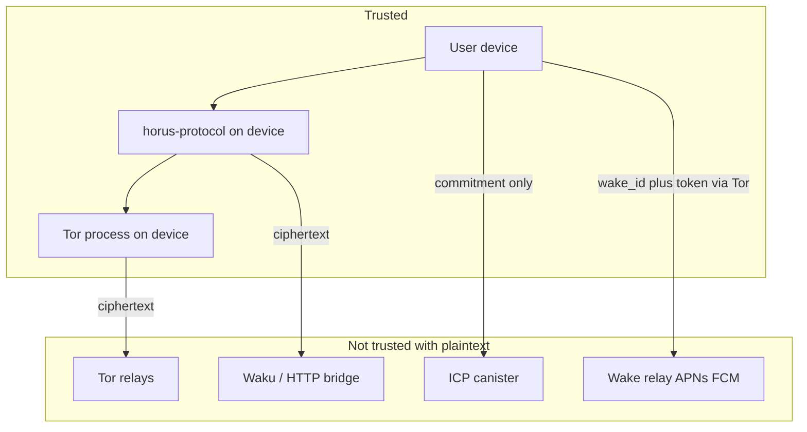
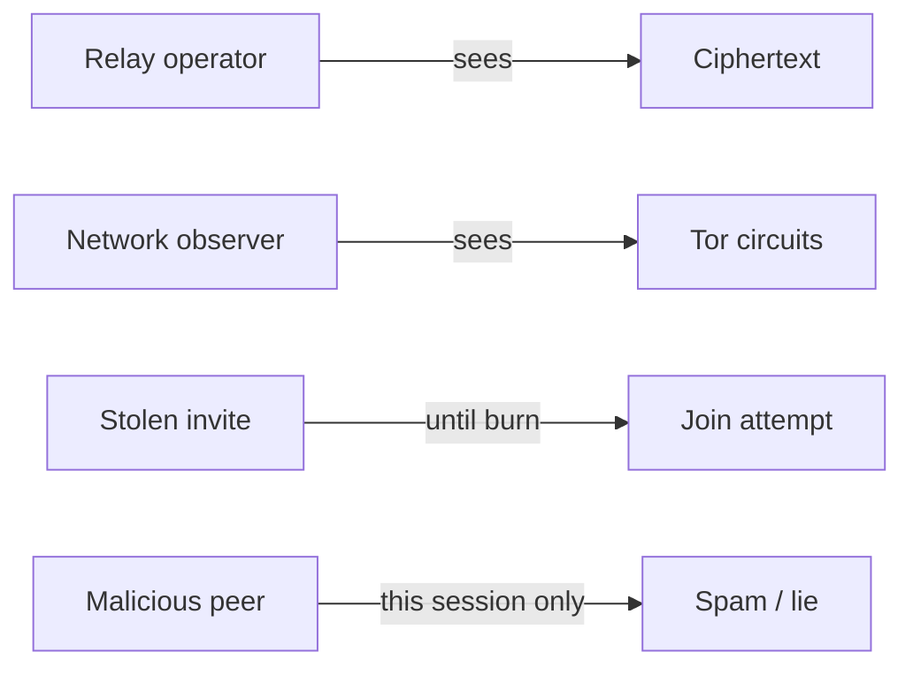

# Security threat model

## Goals

- **Confidentiality:** Only endpoints read message content.  
- **Integrity / authenticity:** Ratchet + AEAD; forged blobs fail open as undecryptable.  
- **Forward secrecy / PCS:** Double Ratchet (+ PQ hybrid on invite).  
- **Metadata minimization:** No phone number; no Horus message server with a global social graph. Tor onion mailboxes reduce linkability versus a central chat API.  
- **Availability under censorship:** Tor helps; BLE gateway helps when a nearby online peer cooperates.

## Trust boundaries

| Component | Trusted for |
|-----------|-------------|
| User devices | Keys, plaintext, UI |
| `horus-protocol` (on device) | Correct encrypt/decrypt |
| Tor process (on device) | Network anonymity for IP toward relays/peers |
| Remote Tor relays / onion path | **Not** trusted with plaintext |
| Dev HTTP / Waku bridge | **Not** trusted with plaintext; can delay/drop/reorder blobs |
| Optional ICP canister | Username commitment only |
| Optional wake relay | `wake_id` → device token; **not** plaintext, chat ids, or keys |

## Adversaries we design against

- Passiveively compromised relay / bridge operator reading traffic → sees ciphertext only.  
- Network observer near the user → Tor raises cost (not magic against a targeted global adversary).  
- Stolen invite link before burn → can attempt join until accept/burn/TTL.  
- Malicious peer → can spam you once paired; cannot decrypt other chats.

## Out of scope / weaker areas (today)

- **Compromised endpoint** (malware on phone) → game over for that user.  
- **Wake-relay metadata:** operator sees when a `wake_id` is pinged; Apple/Google see a generic alert to that device. Knowing `wake_id` is enough to ping (rate-limited).  
- **Push is best-effort.** iOS Focus / Low Power / force-quit can delay or drop APNs. Do not claim iMessage reliability.  
- **Traffic analysis** on Tor/Waku (timing, volume) — mitigated but not eliminated.  
- **No formal audit yet** — required before claiming “production hardened.”  
- **Nation-state targeted correlation** of onion services over long periods.

## Operational security tips for testers

- Reinstall after protocol domain renames (e.g. PiChat → Horus): hard break.  
- Prefer Wi‑Fi/cellular that can reach Tor directory authorities.  
- Do not wipe Tor `cached-*` casually.  
- Treat invites as secrets until burned.
