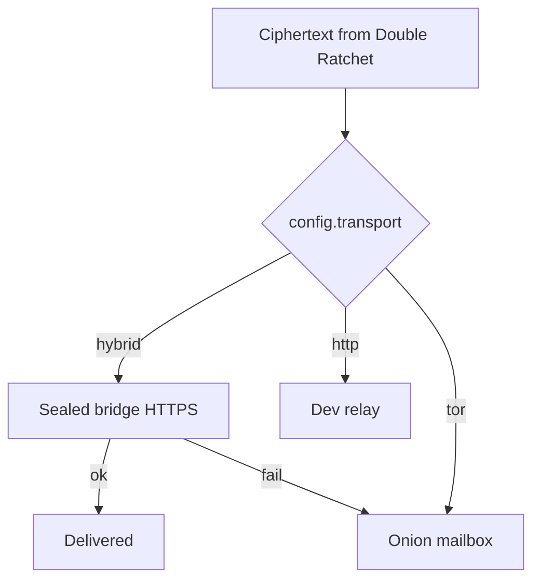
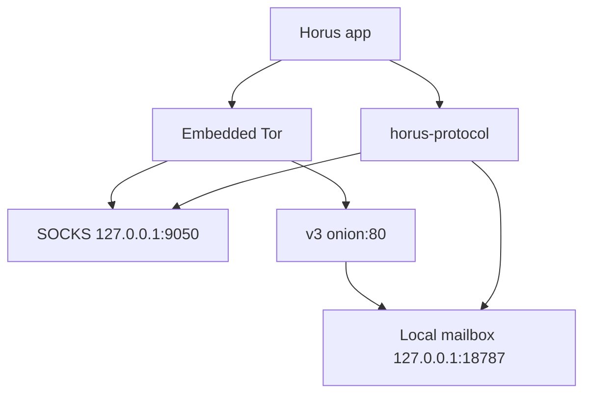
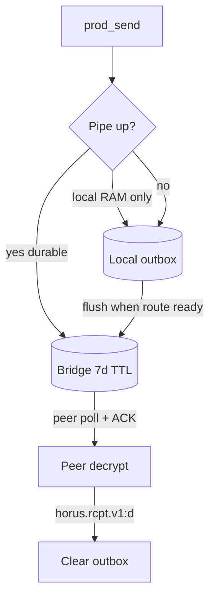

# Transport

Horus separates **encryption** (Double Ratchet) from **movement of opaque blobs** (`BlindPipe`). Apps almost always use `prod_send` / `prod_poll` regardless of which pipe is active.

## Modes

| `transport` | Pipe | When |
|-------------|------|------|
| `hybrid` | Waku-shaped bridge prefer, Tor onion fallback | **Official app default** (`horus_config.json`) |
| `tor` | Onion mailbox via embedded Tor SOCKS | Tor-only builds / fallback path |
| `http` | Dev relay queues | Local development |

See [waku.md](waku.md) for hybrid details.

## Official production path (hybrid)

1. App starts embedded Tor (still required for onion fallback and mailbox).  
2. `start_hybrid` builds a `HybridPipe`: **direct HTTPS** to the bridge (not SOCKS), with TLS SPKI pin + HTTP/1.1 ALPN where configured.  
3. Prefer bridge enqueue; on failure / empty probe, fall back to Tor onion mailbox.  
4. Successful Waku send on the creator path may still **mirror** into the local mailbox so joiner Tor polls do not miss frames.  
5. Bridge store-and-forward uses **lease + ACK** (see below).

Crypto is unchanged: BlindPipe only moves AEAD ciphertext.

## Embedded Tor (fallback / Tor-only)

1. App starts in-process Tor (iOS `EmbeddedTorEngine`, Android `EmbeddedTorBootstrap`).  
2. Tor publishes a v3 onion that forwards port 80 → local mailbox.  
3. Protocol uses SOCKS to reach peer onions and HTTP to the local mailbox.  
4. Bootstrap must reach `PROGRESS=100` (directory loaded). Onion-only paths do **not** require exit nodes.

**Ops note:** Keep Tor’s `cached-*` directory warm. Wiping it forces a multi-minute cold microdesc download.

## Offline & nearby

| Mechanism | Role |
|-----------|------|
| **Bridge store-and-forward** | Opaque ciphertext queued up to **~7 days**. Poll **leases** a message; client **ACK**s (`X-Horus-Lease` → `POST …/ack/{id}`) before delete. Unacked leases redeliver after ~5 minutes. |
| **Local outbox** | Queue until durable pipe accept (`!local:` vs durable); keep until delivery receipt (`horus.rcpt.v1:d`). |
| **Content-free notifications** | “You have a new message” — no preview text |
| **Stay connected** | Android foreground service; iOS best-effort |
| **Wake when closed** | Content-free APNs/FCM ping via wake relay. Ciphertext still on bridge/Tor. **Default on for new installs** (Settings toggle). See [horus-wake-relay](https://github.com/horus-chat/horus-wake-relay). |
| **Share uplink (gateway)** | Online phone optionally relays sealed BLE deposits ([gateway-ble.md](https://github.com/horus-chat/horus-protocol/blob/main/docs/gateway-ble.md)) |
| **BLE chat frames** | Direct/nearby sealed transfer ([chat-ble.md](https://github.com/horus-chat/horus-protocol/blob/main/docs/chat-ble.md)) |

Hard limit: alone + no IP + no cooperating nearby phone ⇒ no instant delivery. Outbox waits.

## What is not transport

- **Calls:** iOS uses WebRTC for realtime voice (signaling on the E2E pipe); Android still uses sealed media frames. Video is not in the current shipping apps. Cross-platform call media is not unified yet.  
- No central Horus MTProto / Firebase message store.  
- Optional wake relay may store `wake_id` + APNs/FCM token. Apple/Google see a generic banner timestamp — never message text.
