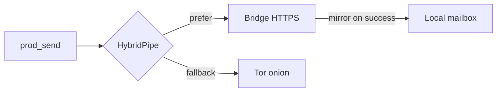

# Waku-shaped hybrid transport

Official Horus apps ship with `"transport": "hybrid"`. That means:

| Mode | Config | Behavior |
|------|--------|----------|
| Hybrid | `"transport": "hybrid"` | **Bridge first**, Tor onion mailbox fallback |
| Tor-only | `"transport": "tor"` | Onion mailbox only |
| HTTP lab | `"transport": "http"` | Dev relay |

Crypto is unchanged. The bridge is a **BlindPipe**: it stores and leases **opaque ciphertext** only.



## Production behavior (v0.7 clients)

- Bridge client uses **direct HTTPS** (not Tor SOCKS) for latency.  
- TLS **SPKI pin** + prefer **HTTP/1.1** ALPN so HTTP/2 does not silently break pinning.  
- Empty / error probes fall back to Tor on short intervals.  
- Creator→joiner: after a successful bridge send on our onion path, ciphertext is also **mirrored** into the local mailbox so a joiner polling Tor does not miss frames.  
- `ensure_mailbox` reuses the Arc so switching Tor-only → hybrid does not drop `:18787`.

## Bridge API shape

Same lease + ACK model as [horus-dev-relay](https://github.com/horus-chat/horus-dev-relay):

```text
POST /waku/v1/queues/<queue-id>
GET  /waku/v1/queues/<queue-id>    # + X-Horus-Lease
POST /waku/v1/ack/<lease-id>
```

Local spike (no VPS):

```bash
cargo run --manifest-path https://github.com/horus-chat/horus-dev-relay/Cargo.toml
# Point hybrid config waku URL at http://127.0.0.1:8787
cd horus-protocol && cargo test -- --test-threads=1
```

Example:

```json
{
  "transport": "hybrid",
  "waku": { "url": "http://127.0.0.1:8787" }
}
```

Official mobile configs point at the operated bridge host (ciphertext only). Do not treat that host as a chat server or identity provider.

## Code map

| Concern | Location |
|---------|----------|
| `HybridPipe` / HTTP client | [`horus-protocol/src/waku.rs`](https://github.com/horus-chat/horus-protocol/blob/main/src/waku.rs) |
| `start_hybrid` | [`horus-protocol/src/prod.rs`](https://github.com/horus-chat/horus-protocol/blob/main/src/prod.rs) |
| Config `waku` + `hybrid` | [`horus-protocol/src/config.rs`](https://github.com/horus-chat/horus-protocol/blob/main/src/config.rs) |

## Trust note

The bridge operator can see **that** ciphertext moved and when. They cannot read message bodies. Tor fallback raises the cost of linking delivery to a clearnet IP when the bridge is unused.
